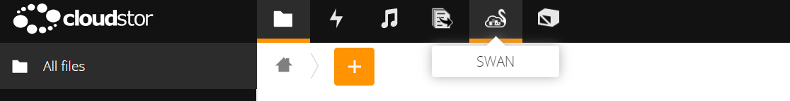
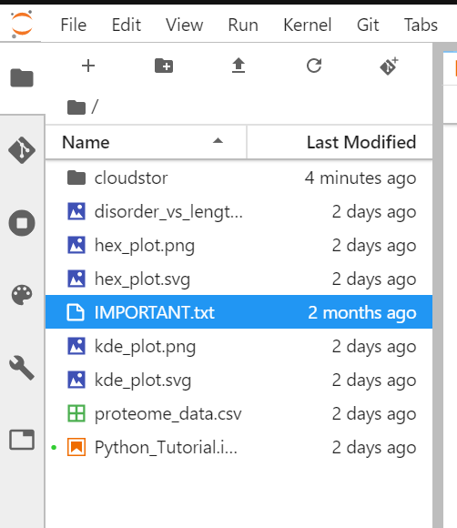
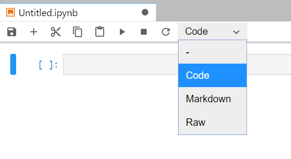
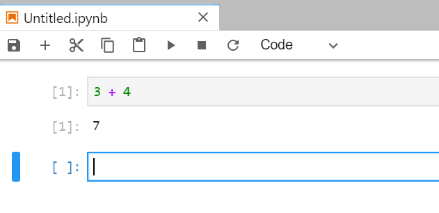

# An Introduction to Python

Python is one of the most popular programming languages, and is widely used in a variety of fields. In particular, Python is used extensively for data science owing to the large number of open-source machine learning and data science libraries written for Python. Python code is designed to be easy to write and easy to read, keeping unnecessary details (such as memory management) hidden from the programmer and user.

While Python often gets a lot of flack for being slower than other languages such as C++ or Fortran, modern Python libraries such as Numpy and TensorFlow are highly optimized for numerical computation, largely eliminating this speed difference.

In this tutorial we will cover some of the basics of Python, with a focus on usage for scientific computing.

This is not intended to be a comprehensive tutorial, but rather a taste of what is possible with Python, as well as providing a general foundation for you to go and explore Python further.


## Part 1: Features of Python


> Python is an interpreted, high-level, general-purpose programming language. *--Wikipedia*

Pros:

- Simple, readable
- An extensive ecosystem of open-source libraries.
- Many great libraries for data analysis and machine learning
- Low-level details such as memory-management are hidden from the user (i.e. high-level)
- Can be used for a wide variety of tasks, including web-programming, scientific analysis, server management, file manipulation etc. (general purpose).

Cons:

- Can be slow (compared to C, Matlab, Java) - although can write compute-intensive parts of code in C or CUDA (for GPU acceleration)...
- Not great for mobile development (i.e. Android)

## Jupyter Lab

We will be using Jupyter Lab to run our Python code for the rest of the tutorial. For participants with access to CloudStor (requires membership of an Australian or New Zealand research institution), visit [CloudStor](https://cloudstor.aarnet.edu.au) and log in with your institutional credentials. Once you have logged into CloudStor, open the SWAN viewer from the main page:



This will start a Jupyter Lab session, in which you can write Python code, add comments or explanations using Markdown, and view data and figures.

If you don't have access to CloudStor, you can also use Jupyter Lab through [Binder](https://jupyter.org/try).

Once Jupyter Lab has started, it's worth familiarising yourself with a few things.

### File explorer



To create a new Notebook, click on the launcher (**`+`** symbol) on the top bar of the file explorer. Select a new Python 3 Notebook.

Once you've started a new notebook, you'll see an empty page with a single cell in which you can enter code, markdown or other text. By default, this cell is set to interpret input as Python code (we will refer to this as a code cell for the rest of the tutorial). You can change the type of cell to either **Markdown** or **Raw** using the drop-down menu at the top of the Notebook:



Try typing some code into the cell (try a simple `3 + 4`). To run this code, you can either press the play button at the top of the Notebook, or run the cell by pressing `Shift-Enter`.

When you run this, you will notice an output appears below the cell, and a number appears beside the cell. This number indicates the order in which the cell was executed.



If there is an asterisk beside a code cell, it indicates that code from this cell is still being processed. If you want to interrupt a cell from processing code, you can press the Stop button at the top of the Notebook.

This is enough of an introduction to get you started. You can read more about Jupyter Lab [here](https://jupyterlab.readthedocs.io/en/stable/user/interface.html) (including some really useful keyboard shortcuts!).
## Working through this tutorial

As you work through this tutorial, you will notice blocks of code that look like:

```python
x = 1
y = 2
print(f"Welcome to Python {x + y}!")
```

This is code that can by typed into a Jupyter Notebook code cell and evaluated (press the play button, or `Shift`-`Enter`).

It is worth typing out each piece of code rather than copying and pasting &mdash; you will notice more about the code by having to type it out.

The output from an evaluted code cell is indicated by a section that looks like:

>   Welcome to Python 3!

You don't have to type this in anywhere - this should appear when you run the preceeding code block.

## A brief note about Python versions...

Python 2.7 was the most commonly used Python version for a long time, but it has now reached the end of its life. A number of breaking changes were introduced in Python 3, making conversion between Python 2 and 3 difficult.

Most major scientific computing projects (Numpy, Scipy etc) are ceasing support for Python 2.7 from 2020 onwards. Under no circumstances should you be writing new code in Python 2.7!!

For any new projects, use Python 3 (ideally the latest stable version &mdash; Python 3.7 at the time of writing).


## A note about links throughout this tutorial

At various points during this tutorial there will be links to further information. Where possible, these are links to the official Python documentation. You are not expected to read these as part of this tutorial &mdash; rather, they are there if you need to dig deeper into a particular topic at some point. While the official documentation can be dense at times, it is also thorough. This often makes it the best source to really understand how the language works.


[**Next Lesson: Variables and data types &#8594;**](https://andrewguy.github.io/training/workshops/Intro_to_Python/lessons/02_variables-and-data-types)

[**&#8592; Back to Lesson Overview**](https://andrewguy.github.io/training/workshops/Intro_to_Python/index)
