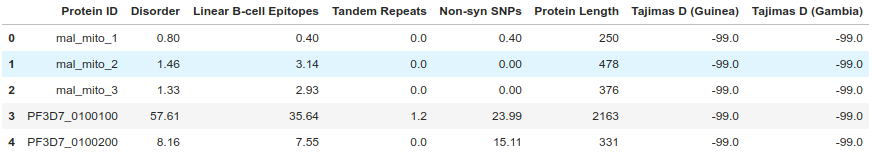
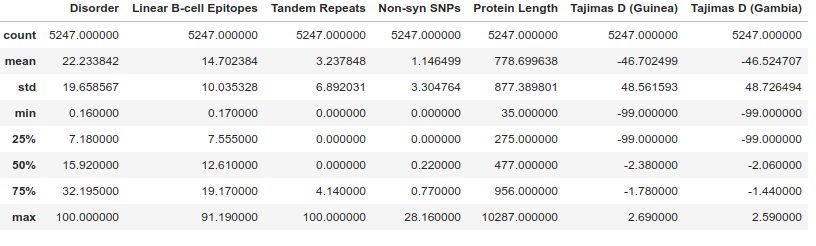
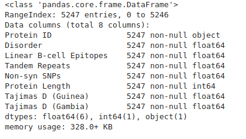
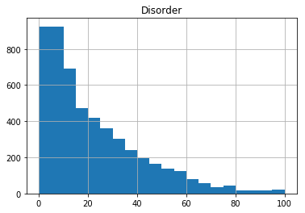
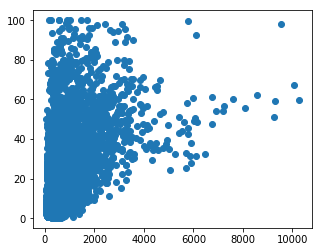
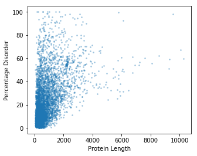
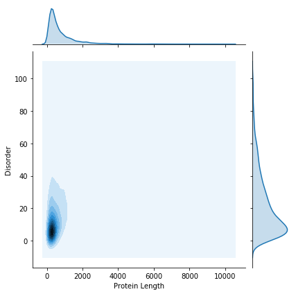
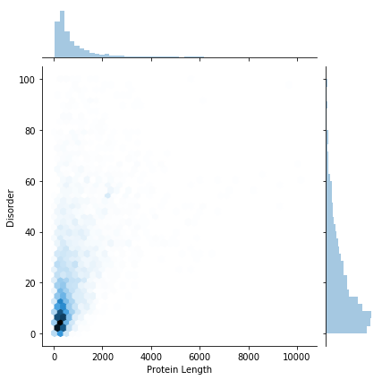

# Part 5: Data manipulation and plotting

## Data exploration with `pandas` and `matplotlib`

Now that we've covered some of the basics of the Python language, we can explore some basic data analysis using the `pandas` and `matplotlib` Python libraries.

If you are using Jupyter Lab through CloudStor or Binder, you should already have the required packages installed.

If you get an error when you try to import the following libraries, you will have to install the relevant package with either `pip` or `conda` package managers (depending on how you have installed Python).

This is as simple as running `pip install seaborn` or `conda install seaborn` in your terminal.


### Import relevant librarires

We begin by importing all the libraries we are likely to use. Don't worry if you're not sure what you will need later on - you can always import a library when you need it. However, it's generally good practice to keep your imports at the start of your document.


```python
import numpy
import pandas
import seaborn
from scipy import stats
import matplotlib.pyplot as plt
```

### Load and examine data

We will now load a `.csv` data file using pandas. If you don't already have this file in your working directory, download it from [here](https://raw.githubusercontent.com/andrewguy/training/master/Intro_to_Python/data/proteome_data.csv).

Alternatively, you can run the following bash code in your Jupyter Notebook to automatically download the file into your working directory (the `%%bash` line is a bit of "cell magic" that tells Jupyter Notebook to run that cell as a bash command):

(Note that this might not work if you are running a local Jupyter notebook on Windows.)


```bash
%%bash
wget https://raw.githubusercontent.com/andrewguy/training/master/workshops/Intro_to_Python/data/proteome_data.csv
```

Loading the data:

```python
gene_data = pandas.read_csv('proteome_data.csv', sep=',')
```

The `gene_data` variable is a Pandas DataFrame:


```python
type(gene_data)
```


>    pandas.core.frame.DataFrame


We can use some of the built in DataFrame functions to examine the data. `head()` shows the first few rows, `describe()` calculates some basic summary statistics, while `info()` gives us detailed information on the columns and types of data in each column.


```python
gene_data.head()
```



```python
gene_data.describe()
```




```python
gene_data.info()
```



 


To access data from a particular column, we can use square brackets `[]`, putting the column name within the brackets (like accessing a dictionary item):


```python
# Get data for a particular column
gene_data['Disorder']
```

(The data output is rather large, so we are not showing it here)


However, if your column names are valid Python variable names, you can access columns using the `.` syntax:

(Note that we don't need to enclose the column name in quotes, unlike when accessing using `[]`.


```python
gene_data.Disorder
```


We could also use an external library (such as `scipy.stats`) to get some basic summary statistics for a column. Note that `stats` was imported from `scipy` earlier.


```python
stats.describe(gene_data['Disorder'])
```


>    DescribeResult(nobs=5247, minmax=(0.16, 100.0), mean=22.23384219554031, variance=386.4592723868353, skewness=1.2867352707379653, kurtosis=1.3764282593472768)


We can also use the default plotting capabilities in `pandas` to plot a quick histogram of the data:


```python
gene_data.hist(column='Disorder')
```


>    array([[<matplotlib.axes._subplots.AxesSubplot object at 0x7f41ee1adef0>]],  
>          dtype=object)


We might want to add more bins to the histogram - we can do this with the `bins` argument in the `hist` function:


```python
gene_data.hist(column='Disorder', bins=20)
```


>    array([[<matplotlib.axes._subplots.AxesSubplot object at 0x7f41ee061eb8>]],
>          dtype=object)





### Using Matplotlib

While we can use the built in plotting functions in `Pandas`, you will end up needing to use `matplotlib` to build more complicated plots.

There are two main ways of plotting with `matplotlib`, which can be very confusing when trying to combine examples from Google!

In brief, these two interfaces are:
- MATLAB style plotting using pyplot
- Object Oriented Interface

We have decided to demonstrate the Object Oriented Interface here, because we feel that this is ultimately more powerful, and arguably much easier to use when constructing complex mutli-panel figures, or working with several figures at once.

With that out of the way, on to some plotting!


We start by creating a [`Figure`](https://matplotlib.org/api/_as_gen/matplotlib.figure.Figure.html#matplotlib.figure.Figure) object. We need to define a bit of `matplotlib` terminology here.

- `Figure` object: A container for all your individual plots.
- `Axes` object: An individual plot. Can be multiple `axes` on a `Figure`.

If we're considering a mutlipanel figure in a scientific journal, the `Figure` object would be the overall figure, whereas the `Axes` would be each individual panel. Don't confuse the `Axes` object with an axis on a plot (e.g. x-axis). These are different things!

### Creating a scatter plot
The following code creates a figure with a single panel (one `Axes` object). We are going to set the figure size (in inches, not pixels!). Note the use of a `tuple` to specify figure size.

We then create a `scatter` plot on the `Axes` object, setting `x` and `y` values to be Protein Length and level of Disorder respectively:


```python
fig, ax = plt.subplots(figsize=(5, 4))

# Now, using the `ax` object, we draw a scatter plot
ax.scatter(x=gene_data['Protein Length'], y=gene_data['Disorder'])

fig.show()
```





This plot is OK, but could do with some polishing. We can't really see all of the points (maybe a density estimation plot would be better??), and we need some labels...


```python
# Initialise a figure, with a number of subplots. Each subplot is called an axis - this is what we draw our plot on.
fig, ax = plt.subplots(figsize=(5, 4))

# Now, using the `ax` object, we draw a scatter plot. Set point size to 3.
# We also add a bit of transparency to each pont (alpha = 0.3)
ax.scatter(x=gene_data['Protein Length'], y=gene_data['Disorder'], s=3, alpha=0.3)

ax.set_ylabel("Percentage Disorder")

ax.set_xlabel("Protein Length")

# Show the plot so far...
fig.show()

# Save the figure...
fig.savefig("disorder_vs_length_scatter.png")
```





We still have an issue with the number of data points. To deal with this, we can do a kernel density estimation.

We will use the seaborn library to do this. Seaborn provides some very nice plotting functions, with a very simple interface.


```python
kde_plot = seaborn.jointplot(x="Protein Length", y="Disorder", data=gene_data, kind="kde")
```





We could also show the data as a hex-bin plot:


```python
hex_plot = seaborn.jointplot(x="Protein Length", y="Disorder", data=gene_data, kind="hex")
```





If we want to save the figures for later use, we just call the `savefig` function:


```python
kde_plot.savefig('kde_plot.png')
hex_plot.savefig('hex_plot.png')
```

It's also worth saving files as `.svg`, which is a vector graphics format. This means you can easily make small adjustments in a program such as Adobe Illustrator or Inkscape.


```python
kde_plot.savefig('kde_plot.svg')
hex_plot.savefig('hex_plot.svg')
```


[**Next Lesson: Getting Help &#8594;**](https://andrewguy.github.io/training/workshops/Intro_to_Python/lessons/06_getting-help)


[**&#8592; Previous Lesson: Imports and Packages**](https://andrewguy.github.io/training/workshops/Intro_to_Python/lessons/04_imports-and-packages)
