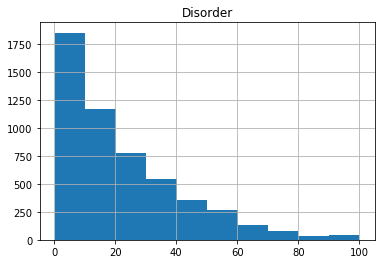
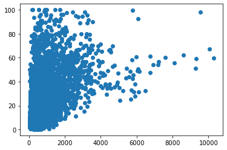
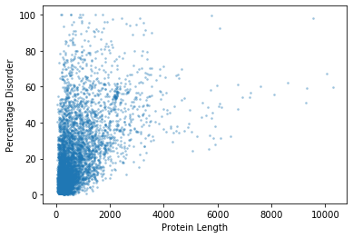
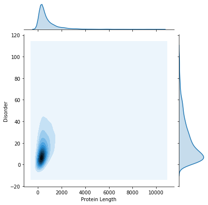
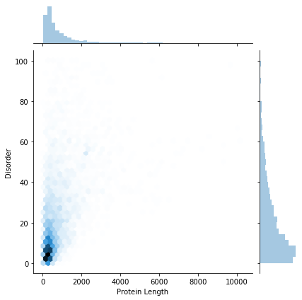

# Part 5: Doing something useful...


```python
import numpy
import pandas
from scipy import stats
import matplotlib.pyplot as plt
```


```python
gene_data = pandas.read_csv('proteome_data.csv', sep=',')
```


```python
# Examine the first few rows in the data frame.
gene_data.head()
```


<div>
<style scoped>
    .dataframe tbody tr th:only-of-type {
        vertical-align: middle;
    }

    .dataframe tbody tr th {
        vertical-align: top;
    }

    .dataframe thead th {
        text-align: right;
    }
</style>
<table border="1" class="dataframe">
  <thead>
    <tr style="text-align: right;">
      <th></th>
      <th>Protein ID</th>
      <th>Disorder</th>
      <th>Linear B-cell Epitopes</th>
      <th>Tandem Repeats</th>
      <th>Non-syn SNPs</th>
      <th>Protein Length</th>
      <th>Tajimas D (Guinea)</th>
      <th>Tajimas D (Gambia)</th>
    </tr>
  </thead>
  <tbody>
    <tr>
      <th>0</th>
      <td>mal_mito_1</td>
      <td>0.80</td>
      <td>0.40</td>
      <td>0.0</td>
      <td>0.40</td>
      <td>250</td>
      <td>-99.0</td>
      <td>-99.0</td>
    </tr>
    <tr>
      <th>1</th>
      <td>mal_mito_2</td>
      <td>1.46</td>
      <td>3.14</td>
      <td>0.0</td>
      <td>0.00</td>
      <td>478</td>
      <td>-99.0</td>
      <td>-99.0</td>
    </tr>
    <tr>
      <th>2</th>
      <td>mal_mito_3</td>
      <td>1.33</td>
      <td>2.93</td>
      <td>0.0</td>
      <td>0.00</td>
      <td>376</td>
      <td>-99.0</td>
      <td>-99.0</td>
    </tr>
    <tr>
      <th>3</th>
      <td>PF3D7_0100100</td>
      <td>57.61</td>
      <td>35.64</td>
      <td>1.2</td>
      <td>23.99</td>
      <td>2163</td>
      <td>-99.0</td>
      <td>-99.0</td>
    </tr>
    <tr>
      <th>4</th>
      <td>PF3D7_0100200</td>
      <td>8.16</td>
      <td>7.55</td>
      <td>0.0</td>
      <td>15.11</td>
      <td>331</td>
      <td>-99.0</td>
      <td>-99.0</td>
    </tr>
  </tbody>
</table>
</div>


```python
# See what columns are labelled
gene_data.columns
```


    Index(['Protein ID', 'Disorder', 'Linear B-cell Epitopes', 'Tandem Repeats',
           'Non-syn SNPs', 'Protein Length', 'Tajimas D (Guinea)',
           'Tajimas D (Gambia)'],
          dtype='object')


```python
# Get data for a particular column
gene_data['Disorder']
```


    0        0.80
    1        1.46
    2        1.33
    3       57.61
    4        8.16
    5       32.71
    6        2.69
    7        7.80
    8        2.99
    9        7.85
    10       5.14
    11      12.29
    12       7.44
    13       9.13
    14       4.26
    15       3.25
    16       6.92
    17       5.25
    18      50.51
    19       7.69
    20      55.14
    21      16.19
    22      16.67
    23       5.60
    24      14.54
    25      30.12
    26      36.84
    27       2.53
    28      27.89
    29      27.72
            ...  
    5217     2.97
    5218    25.60
    5219    48.64
    5220    18.21
    5221     2.22
    5222    14.54
    5223     3.24
    5224    77.99
    5225     0.51
    5226    13.41
    5227     6.67
    5228    14.79
    5229     8.64
    5230    11.71
    5231    11.43
    5232     2.87
    5233     6.10
    5234     7.89
    5235     2.94
    5236     6.74
    5237     0.87
    5238     2.82
    5239     2.48
    5240     1.27
    5241     0.73
    5242    31.15
    5243    11.11
    5244     2.33
    5245     8.16
    5246     3.39
    Name: Disorder, Length: 5247, dtype: float64


```python
# Summarise data

stats.describe(gene_data['Disorder'])
```


    DescribeResult(nobs=5247, minmax=(0.16, 100.0), mean=22.23384219554031, variance=386.4592723868353, skewness=1.2867352707379653, kurtosis=1.3764282593472768)


```python
# Plot some data - using built in histogram function in Pandas dataframes

gene_data.hist(column='Disorder')
```


    array([[<matplotlib.axes._subplots.AxesSubplot object at 0x7f080eac2eb8>]],
          dtype=object)





While we can use the built in plotting functions in `Pandas`, you will end up needing to use `matplotlib` to build more complicated plots.


```python
# Initialise a figure, with a number of subplots. Each subplot is called an axis - this is what we draw our plot on.
fig, ax = plt.subplots()

# Now, using the `ax` object, we draw a scatter plot
ax.scatter(x=gene_data['Protein Length'], y=gene_data['Disorder'])

# Show the plot so far...
fig.show()
```





This plot is OK, but could do with some polishing. We can't really see all of the points (maybe a density estimation plot would be better??), and we need some labels...


```python
# Initialise a figure, with a number of subplots. Each subplot is called an axis - this is what we draw our plot on.
fig, ax = plt.subplots()

# Now, using the `ax` object, we draw a scatter plot. Set point size to 3.
# We also add a bit of transparency to each pont (alpha = 0.3)
ax.scatter(x=gene_data['Protein Length'], y=gene_data['Disorder'], s=3, alpha=0.3)

ax.set_ylabel("Percentage Disorder")

ax.set_xlabel("Protein Length")

# Show the plot so far...
fig.show()

# Save the figure...
fig.savefig("disorder_vs_length_scatter.png")
```





```python
# We still have an issue with the number of data points.
# We can try and do a kernel density estimation
# We will use the seaborn library to do this.
# Seaborn provides some very nice plotting functions, with a very simple interface.

import seaborn

kde_plot = seaborn.jointplot(x="Protein Length", y="Disorder", data=gene_data, kind="kde")
```





```python
# We could also show the data as a hexbin plot
hex_plot = seaborn.jointplot(x="Protein Length", y="Disorder", data=gene_data, kind="hex")
```





```python
kde_plot.savefig('kde_plot.png')
hex_plot.savefig('hex_plot.png')

```

# Part 3: Getting help

There are a number of ways to get help or figure out how to do something new:
    
- Google it
- Stackoverflow
- Read the documentation (often surprisingly useful)
- Look at the source code (can be difficult, but sometimes needed)

Generally:

- If you don't know what tools you need, or what packages you need to use: **Google or Stackoverflow**
- If you are having trouble with code not working, an unusual error etc: **Google or Stackoverflow**
- If you want to know details about a specific package or function: **Documentation or source code.** Google or Stackoverflow if this doesn't help.

Being a proficient coder is not about knowing the details of every package, but rather knowing how to search for this information effectively...


```python

```